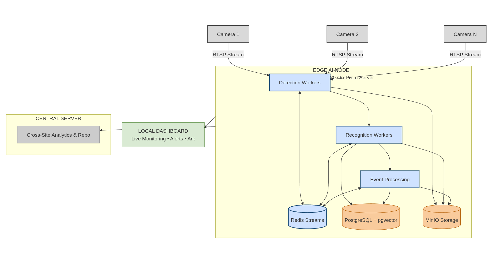

# Feature List

1. Face Recognition with Deduplication
2. Face Tokenization
3. Restricted Entry Detection
4. Headcount Monitoring
5. Crowd Desnity & Crowd Management
6. Zone-Based Marking, Monitoring and Virtual Boundaries
7. Intruder Detection
8. Pedestrian Detection

---

# High Level Architecture



---

# Core Technologies

| **Component** | **Tech** |
| --- | --- |
| API | FastAPI |
| Database | PostgreSQL |
| Vector Search | pgvector |
| Event Bus | Redis Streams |
| Object Storage | MinIO |
| Detection | RT-DETR-L; YOLOv11m; YOLOv8m  |
| Recognition | InsightFace |
| Tracking | Bot-Sort; ByteTrack |
| Crowd Density | CSRNet; CrowdFormer; DMCount |
| Dashboard | React |
| ORM | SQLAlchemy |
| Schema Migrations | Alembic |
| Containerization+Orchestration | Docker & Docker Compose |
| Reverse Proxy | Nginx |
| Metrics & Dashboard | Prometheus + Grafana |
| Log Aggregation | Loki |
| Distributed Tracing | OpenTelemetry |
| Async Task Workers | Celery |
| RTSP Stream Ingestion | FFmpeg; DeepStream |

---

# Service Overview

### 1. Ingestion

- Reads RTSP streams.
- Uses FFmpeg / DeepStream.
- Stores frames in MinIO
- Publishes FrameEvenets.

### 2. Detection

- Runs RT-DETR; YOLOv11m; YOLOv8m.
- Runs BoT-SORT; ByteTrack.
- Publishes DetectionEvents

### 3. Recognition

- Runs InsightFace.
- Performs identity matching.
- Publishes RecognitionEvents.

### 4. Event Processing

- Zone Monitoring
- Headcount
- Crowd Density
- Restricted Entry
- Intruder Detection

### 5. API

- REST APIs
- WebSockets
- Alert Distribution

### 6. Dashboard

- Live monitoring
- Alert management
- Enrollment
- Reporting

---

# Data Flow

1. Camera produces RTSP stream.
2. Ingestion reads frame
3. Frame stored in MinIO
4. FrameEvent published
5. Detection consumes FrameEvent
6. DetectionEvent published
7. Recognition consumes DetectionEvent
8. RecognitionEvent published
9. Event workers generate alerts
10. API pushes alerts to dashboard

---

# Redis Stream Architecture

```
frames:{camera_id}
    ↓
Detection
    ↓
events:detections
    ↓
Recognition
Zone
Headcount
Pedestrian

events:recognitions
    ↓
Restricted Entry
Intruder Detection

alerts:live
    ↓
API
```

---

# Storage Overview

MinIO Buckets:

- innovision-snapshots (Frame jpegs, alert snapshots)
- innovision-reports (generated pdf reports)
- innovision-clips (video clips)

---

# Development Workflow

1. Create feature branch
2. Implement
3. Write tests
4. Run smoke tests
5. Open PR
6. Review
7. Merge

---

# Documentation

After each PR, create a doc that explains:

- What was added
- What was removed
- What was modified
- What is the goal of the PR Implementation